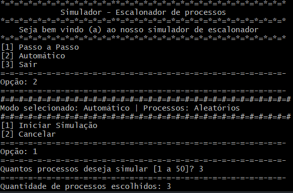

# ⚙️ Simulador de Escalonamento de Processos - ICP246

- 📚 Trabalho acadêmico desenvolvido para a disciplina de **Arquitetura de Computadores e Sistemas Operacionais - ICP246 (2025-1)**  
- 🎓 Universidade Federal do Rio de janeiro ( UFRJ )  

---

Um simulador educacional de gerenciamento de processos, que utiliza o algoritmo de escalonamento **Round Robin com Feedback**, implementado em linguagem C.  
Permite observar como a CPU, o I/O e as prioridades interagem ao longo da execução dos processos. ⚙️📊

---

## 📸 Exemplo de execução



---

## 🎯 Funcionalidades

- Geração de até **50 processos aleatórios**, com prioridade, tempo de chegada e I/O
- Simulação com **quantum configurado (Round Robin)** e sistema de **feedback com preempção**
- Filas independentes:  
  - 🟢 Alta prioridade  
  - 🟡 Baixa prioridade  
  - 🔵 I/O única (simula vários dispositivos ao mesmo tempo)
- Modos de simulação:
  - `[1] Passo a passo` 🔂  
  - `[2] Automático` ⚡
- Exibição visual do estado das filas e da CPU a cada ciclo
- Estatísticas completas ao fim da execução

---

## 🧠 Como funciona o simulador?

O simulador segue uma estrutura baseada em **quatro filas principais**:

- 🟢 Fila de Alta prioridade
- 🟡 Fila Baixa prioridade
- 🔵 Fila I/O única - Processos que estão aguardando a conclusão de I/O
- 🔴 Fila de Chegada - Processos que ainda não chegaram (aguardam seu tempo de chegada)

A cada ciclo:
- A CPU executa o processo atual por até 4 ciclos (quantum)
- Se o processo:
  - Finalizar 🏁 → é removido
  - Pedir I/O 🎧 → vai para a fila de I/O
  - Estourar o quantum ⏳ → é enviado para a fila de baixa prioridade
- A fila de chegada é decrementada continuamente para simular o tempo de chegada
- A fila de I/O processa todos os seus elementos em paralelo a cada ciclo

---

## 📁 Estrutura do Projeto

---
```
- ├── bin/ # Código-fonte principal
- │ ├── main.c # Lógica principal e menu
- │ ├── main_teste.c # Teste de processos inseridos manualmente
- │ ├── process_libs.c # Gerenciamento de ciclos, geração de processos e I/O
- │ ├── queue_libs.c # Manipulação das filas
- │ └── files_libs.c # Funções para criar logs txt da simulação
- | └── icp246_libs.h # Cabeçalhos e definições globais
- ├── assets/ # Recursos auxiliares
- | └── screenshots/ # screenshots do programa
- ├── docs/ # Documentação do trabalho
- │ └── relatorio.pdf # Relatório final
- └── README.md # Este arquivo
```
---

## 🧪 Como Compilar

### 🔧 Requisitos

- Compilador `gcc`
- Ambiente com terminal (Linux, WSL ou MSYS2 para Windows)

### ✅ Compilação

```bash
gcc -g -o main.exe main.c queue_libs.c process_libs.c files_libs.c
```
```bash
gcc -g -o main_teste.exe main_teste.c queue_libs.c process_libs.c files_libs.c
```
---

## 📊 Estatísticas exibidas
### Ao final da simulação são apresentadas:

- Total de ciclos executados
- Total de processos finalizados
- Preempções realizadas
- Operações de I/O realizadas
- Ciclos com CPU ociosa
- Tempo médio por processo
- Throughput ( Processos por ciclo )
- Processos que retornaram da I/O
- Tipos de I/O utilizados: Disco 🖴, Fita Magnética 📼, Impressora 🖨
  
---

## 👨‍💻 Autor
- Desenvolvido por **Dhemerson Sousa**  
🔗 GitHub: [@Rebornned](https://github.com/Rebornned)

---

---

## 🚀 Tecnologias Utilizadas

<p align="left">
  
  
  
</p>

---

## 📜 Licença

- Este projeto está licenciado sob a [Creative Commons Attribution-NonCommercial 4.0 International (CC BY-NC 4.0)](https://creativecommons.org/licenses/by-nc/4.0/).  
- 📌 **Este projeto é educativo e não deve ser utilizado com fins comerciais.**  

---
